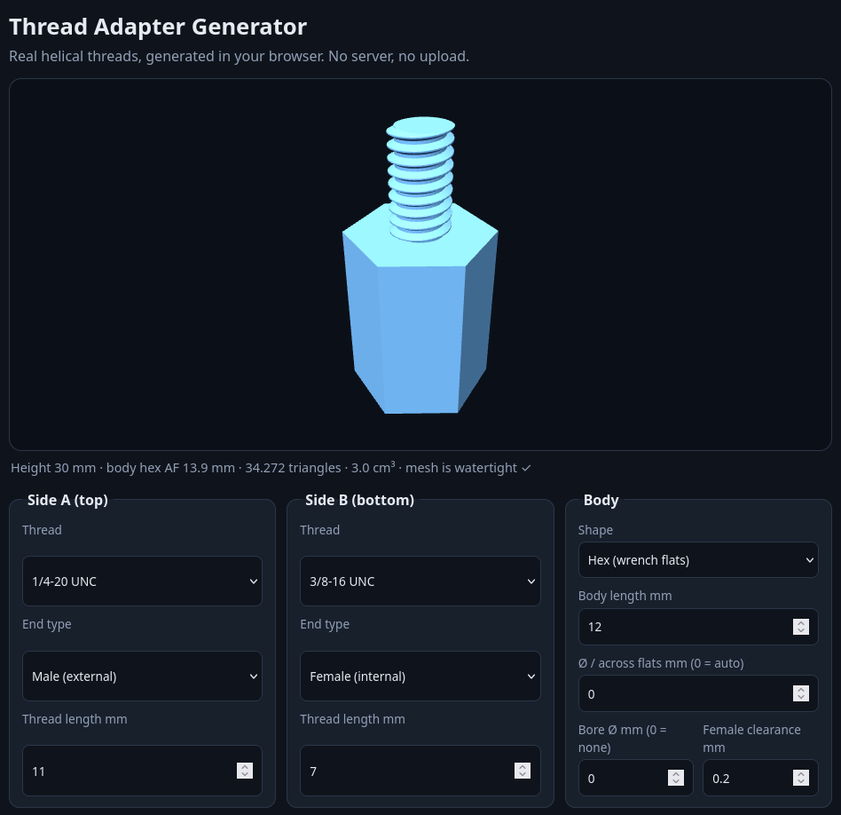

# Thread Adapter Generator

Turn one thread size into another with a real, printable helical screw thread — right in your browser.

## Getting it

Download the single file `Thread Adapter Generator.html` — that's the whole app.

## Running it

- **Directly:** double-click the downloaded HTML file (or drag it into a browser tab). It opens in any modern browser and works immediately.
- **From a server:** put the HTML file on any web server or static host and open its URL. No build step, no installation, no dependencies.

Everything runs **locally in your browser**. All thread geometry and STL generation are computed on your own machine — nothing is uploaded, nothing is sent to a server, and no account is needed. It even works offline once you have the file.

## Using it

1. Pick the two thread sizes you want to connect.
2. Optionally turn either side into a **screw head** instead of a thread — **flat**, **slotted**, or with an **allen (hex) socket**. The head is the body shape with the drive feature cut into its flat face; drive sizes are derived from the body Ø and reported under the preview.
3. Adjust the options if you like (e.g. radial clearance).
4. Download the STL and print it.

## Printing notes

- Print **upright**, exactly as exported (axis vertical).
- Right-hand threads with 60° flanks.
- Female threads get the radial clearance you set — start with **0.2 mm** for FDM and test-fit.
- Thread starts get a **45° lead-in chamfer** sized to the thread (one thread depth deep): male tips taper from root Ø to major Ø, female openings flare to the major Ø. Disable it with the *Chamfer thread starts* checkbox.
